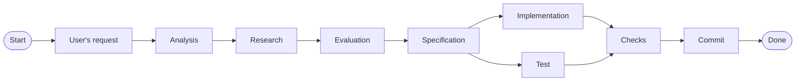

# Changes Implementation Guide

These are the instructions you must follow while making any kind of changes. There are two type of changes:

- **Small changes**: These are the changes that are very small that including in minor modification such as changing a small config, updating a small part of the docs, updating packages, renaming files/components, etc. Some times user also hints these changes as small or insignificant.
- **Non-small changes**: All the other changes that are not small changes comes under this category and major part of this docs is related to the management of these changes.

Both types of changes follows the same abstract workflow i.e.,

## Common Starting Steps

These are the common steps that needs to be followed both in small and non-small changes need to follow these starting steps.

1. User's input requirement must be analyzed properly.
2. If the requirements are underspecified or has any conflicts clear them with user by invoking /grill-me skill.
3. Once requirements are clear, you must perform deep research on the specified requirements. The research must be done using valid verified up-to-date sources.
4. If there any conflicts with requirements, then invoke the /grill-me skill and resolve the conflict to reach common understanding. Explain the conflict, referred sources, possible fixes in simpler and easier words.

## Small Changes workflow

If the given changes are small changes,

1. Follow the step mentioned in [common-starting-steps](#common-starting-steps).
2. If you're in `main` branch, then create a new branch from `main` branch.
3. Instead of generating spec docs, give the spec details directly to the user to get them reviewed.
4. Once user approves the specs, then implement the changes.
5. If the spec include changes in code base, then subagents must write test-cases/test-suite for the related changes.
6. Perform the checks and wait till user reviews the changes.
7. Once user approaves, commit the changes.

## Non-small Changes workflow

If the give changes are non-small changes, but more complex changes; Then follow the below steps,

1. Follow the step mentioned in [common-starting-steps](#common-starting-steps).
2. If you're in `main` branch, then create a new branch from `main` branch.
3. Based on users requirement and research details, Draft a specification file at `docs/specs/<users-requirement>_<date-timestamp>.spec.md`.
4. Once user approves it, then plan the changes into indivdiual smaller modular changes.
5. Each change must have it's own relevant test written and tested. The test must be generated based on the spec file.
6. Once single change must pass all the checks including the test-cases/test-suites, it must be commited.
7. Only once that single change is commited successfully, then you can procceed to next change.
8. Repeat the process of {specs -> single change -> test & implementation created parallely -> all checks pass -> commit} for all small individual changes.
9. Once everything is done, let the user review the changes.

Additional instructions:

- Timestamp string format should be `%Y%m%d_%H%M%S`
- Use subagents to generate test-cases/test-suites relavant to the change based on spec. Generate relevant unit/integration/regression/e2e tests based on the users requirement.
- Prefer creating test before changes.
