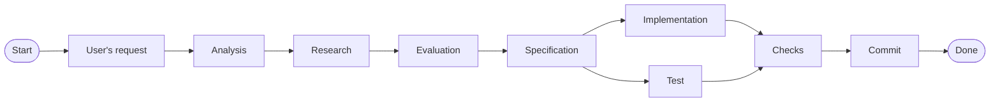

# AGENTS.md

This project is an Model Context Protocol (MCP) server project for big data devs.
This helps agents used stremline their access to multiple resource from a single point of contact with stricter guardrails.
Currently the MCP server is designed only for read-only operations.

> Note that this project is at it very beginning stage, so you are allowed to make major refactoring and changes across the source code.

## Tooling

### Environment

- `uv` is used as package manager of this repo.
- For pre-commit hooks, `prek` is used.
- Use ripgrep `rg` instread of normal `grep`.
- All primary used commands are aggregated within Makefile.
- Use `zsh`/`bash` as your primary terminal.

### Commands

Run everything through the Makefile. The Makefile mirrors
`.pre-commit-config.yaml`, so the two cannot drift. `make` with no target prints
the full list.

Here're the command that you needed you for your every task,

| Task | Command |
| --- | --- |
| Ruff formatting | `make fmt` |
| Lint / format check | `make lint-check` / `make format-check` |
| Type check | `make typecheck` (strict; warnings are errors) |
| Complexity gate | `make complexity` (max 15) |
| Tests on changed files only | `make testmon` |
| Tests | `make test` (coverage floor 80 applies) |
| Workflow validation | `make workflows` (actionlint + shellcheck) |
| Codacy SAST (pre-push) | `make codacy` |
| CodeRabbit stored findings (advisory, cannot block the push) | `make coderabbit` |
| Everything CI gates on | `make verify` |

Style config lives in `pyproject.toml` — read it, do not restate it. That table
is the canonical copy; `CONTRIBUTING.md` points here.

## Subagent Instructions

Subagents are powerful tools that help you stay focused on the main task by delegating related supporting tasks to specialized agents.
Each subagent can focus deeply on a specific area, while you concentrate on the primary goal.

When delegating a task to a subagent, give it clear and specific instructions focused on the smallest meaningful unit of work.
If the task is more complex, break it down into smaller, independent tasks and delegate each one to a separate subagent.
Run subagents in parallel when tasks are independent and have no shared dependencies.

Fundamentally all the tasks that can be delegated to subagents can be categorized into **read-only** operations, **write** operations.

### Read-only subagents

There are no restrictions for delegating subagents for read-only tasks such as,

- Repo Exploration
- Research
- Validation
- Critique
- Code review

Research is one of the critial for any given task because,

- Helps you get update information that is relevant to the given task.
- Helps you avoid any outdate information or misinterpretation that originated from your knowledge.
- Educates you of typical antipatterns or loophole that could misguide your task.
- Educates you with what is feasible and practical to implement and be truthful to end user based on facts & evidences.
- Provides you with enough information to help you communicate better with end users in much simpler and easier-to-understand terms.

Research when it can improve the answer,

- Check for current and relevant information.
- Consider important perspectives and possible interpretations.
- Prefer verified information from reliable sources.
- Use multiple independent sources.
- Use the findings to give clear and accurate answers.

### Write subagents

Subagents for write opertions are heavily restricted for the following usecases:

- Writing unbiased test-cases/test-suite.
- Multiple highly surigcial non-critical writes.

When you delegate subagents to write test-cases/test-suites,

- Only provide users-query/agreed-specifications and with instruction to write test.
- The tests should cover meaningfully 100% of code coverage.
- When writing tests of existing source code, then only describe the behavior of the change. Nothing more, Nothing less.

Apart from writing tests, the only write operation allowed by subagent is highly surigcial non-critical writes. When the changes are small & non-critical and required updating multiple part of the repo, then use subagents for write operations.

For example, Suppose a core dependency has a new major version with an API, function, or class that replaces complex manual logic with a simpler abstraction.

Adopting the new version requires changes to multiple parts of the codebase, such as the dependency manifest, source code, and tests.

1. Analyze the codebase and determine all required changes.
2. Identify small, independent changes that can be performed safely in parallel.
3. Delegate each change to a separate subagent.
4. For each subagent, specify the files it should modify and the exact change it should make.
5. Include verification steps for each subagent's change.
6. Review the subagents' changes after they finish.

Therefore the subagent orchestration can as follows,

- one subagent can update the dependency manifest and verify dependency resolution.
- Another can update the affected source code and run its relevant tests.
- A third can update the corresponding tests and verify that they pass.

## Agentic workflow

These are the instructions you must follow while making any kind of changes. There are two type of changes:

- **Small changes**: These are the changes that are very small that including in minor modification such as changing a small config, updating a small part of the docs, updating packages, renaming files/components, etc. Some times user also hints these changes as small or insignificant.
- **Non-small changes**: All the other changes that are not small changes comes under this category and major part of this docs is related to the management of these changes.

Both types of changes follows the same abstract workflow i.e.,

### Common Starting Steps

These are the common steps that needs to be followed both in small and non-small changes need to follow these starting steps.

1. User's input requirement must be analyzed properly.
2. If the requirements are underspecified or has any conflicts clear them with user by invoking /grill-me skill.
3. Once requirements are clear, you must perform deep research on the specified requirements. The research must be done using valid verified up-to-date sources.
4. If there any conflicts with requirements, then invoke the /grill-me skill and resolve the conflict to reach common understanding. Explain the conflict, referred sources, possible fixes in simpler and easier words.

### Small Changes workflow

If the given changes are small changes,

1. Follow the step mentioned in [common-starting-steps](#common-starting-steps).
2. If you're in `main` branch, then create a new branch from `main` branch.
3. Instead of generating spec docs, give the spec details directly to the user to get them reviewed.
4. Once user approves the specs, then implement the changes.
5. If the spec include changes in code base, then subagents must write test-cases/test-suite for the related changes.
6. Perform the checks and wait till user reviews the changes.
7. Once user approaves, commit the changes.

### Non-small Changes workflow

If the give changes are non-small changes, but more complex changes; Then follow the below steps,

1. Follow the step mentioned in [common-starting-steps](#common-starting-steps).
2. If you're in `main` branch, then create a new branch from `main` branch.
3. Based on users requirement and research details, Draft a specification file at `docs/specs/<users-requirement>_<date-timestamp>.spec.md`.
4. Once user approves it, then plan the changes into indivdiual smaller modular changes.
5. Each change must have it's own relevant test written and tested. The test must be generated based on the spec file.
6. Once single change must pass all the checks including the test-cases/test-suites, it must be commited.
7. Only once that single change is commited successfully, then you can procceed to next change.
8. Repeat the process of {specs -> single change -> test & implementation created parallely -> all checks pass -> commit} for all small individual changes.
9. Once everything is done, let the user review the changes.

Additional instructions:

- Timestamp string format should be `%Y%m%d_%H%M%S`
- Use subagents to generate test-cases/test-suites relavant to the change based on spec.
- Generate relevant unit/integration/regression/e2e tests based on the users requirement.
- Prefer creating test before changes.
- Config-only changes are not exempt from tests. Add an assertion in
  `tests/test_repo_contracts.py` that the configuration encodes the decision it
  exists for, and that fails if the decision is reverted.

Two failure modes to name explicitly in a PR description, because both survive
review unnoticed:

- **Taxidermy tests.** Well-formed tests that assert nothing. A test that only
  proves "the code runs" passes whether or not the behaviour is correct. Every
  assertion must be *able* to fail: break the thing it covers, watch it go red,
  restore it, and report the evidence you saw.
- **Symptom patches.** Making a consumer tolerate bad data instead of fixing the
  producer. If a value is wrong at a boundary, fix it at the boundary.

A subagent that reports "tests pass" without mutation evidence has not finished
the task. Ask for the red-then-green transcript.

## Additional Instructions

- [Commit Insturctions](.agents/instructions/commit.instruction.md)
